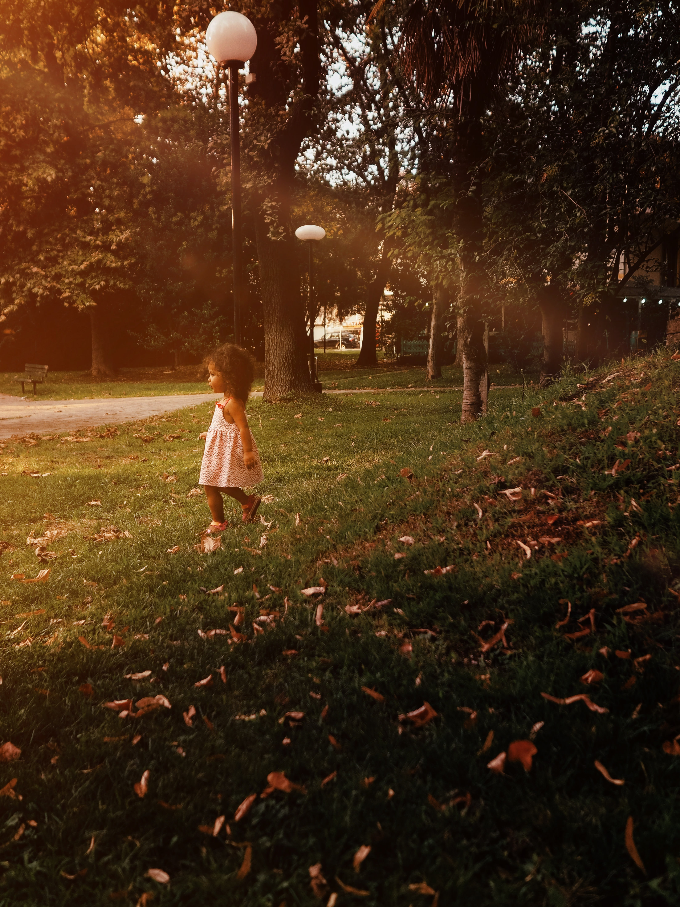

# Η Ελισάβετ παίζοντας 

### Οι μικρές χαρές που μας δίνουν απλόχερα τα παιδιά μας πόσο αξίζουν σε χρήμα;

Το έχετε αναλογιστεί ποτέ; Στην κοινωνία της απόλυτης χρείας, με άλλα λόγια στην κοινωνία που οι άνθρωποι μέτρουν τα πάντα με νούμερα δηλαδη χρήμα, στο κόσμο που η παιδικότητα λογίζεται σαν καθυστέρηση σαν κάτι χαζό γιατί αυτές οι μοναδικές χαρές που μας δίνουν τα παιδιά μας προκαλούν ρίγη συγκίνησης και ελπίδα για το αύριο;

Μία απάντηση που μου έρχεται αμέσως στο μυαλό μου είναι η πίστη οτι ο άνθρωπος δεν έχει αλλοιτριωθεί πλήρως ακόμη. Κάτι μας έχει μείνει από την καλή μας πλευρά. Κάτι που ακόμη ζεί μέσα στις ψυχές μας και εναντιώνεται με τη σήψη και την αλλοτρίωση του σημερινού μοντέρνου ανθρώπου.

Πόσο χαίρομαι να βλέπω τις αντιδράσεις των παιδιών όταν παίζουν, όταν τρέχουν, όταν γελάνε, όταν κλαίνε, όταν τρώνε, όταν τέλως πάντων κάνουν οτιδήποτε. Ζουν. Κάτι που εμείς στον κόσμο των μεγάλων έχουμε ξεχάσει.

